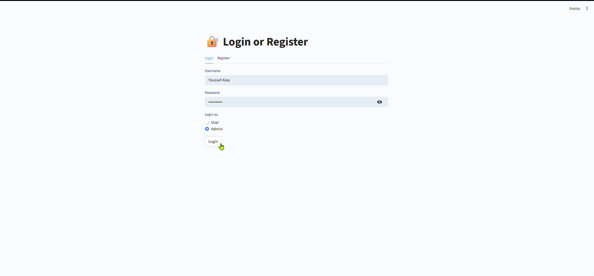
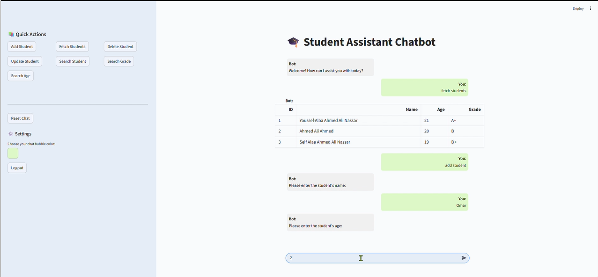

# 🎓 Student Management Chatbot (Streamlit + MySQL)

This is a **student management system** built using **Python**, **MySQL**, and **Streamlit**, with a simple chatbot interface that performs actions based on predefined commands. It supports both **Admin** and **User** roles with a registration and login system. The chatbot interacts with a MySQL database to manage student records.

---

## 📌 Features

### ✅ User Roles
- **Admin** can:
  - Add new students
  - Update existing student details
  - Delete students
  - Fetch and view all student records
- **User** can:
  - Ask questions through the chatbot
  - View student records
  - Search for student details
  - Use buttons or text commands to trigger actions

### 💬 Chatbot Interface
- Responds to predefined commands:
  - `"add student"`
  - `"update student"`
  - `"delete student"`
  - `"fetch students"`
- Interacts with users step-by-step (e.g., asks for name, age, grade one at a time).
- All responses are shown in chat bubbles (user on the right, bot on the left).
- Users can also trigger actions via the **sidebar buttons**.

### 🧩 Streamlit UI
- Responsive layout with chat message styling.
- Sidebar includes:
  - Action buttons
  - Color customization for chat bubbles
  - Chat reset
- Dynamic support for light and dark modes.

### 🔐 Login & Registration
- Users can register and log in.
- Admin credentials are hardcoded into `credentials.json`.
- User credentials are stored in `users.json`.
- Passwords are stored as **plain text**.

---

## 🖼️ Screenshots

### 🔓 Login Page

### 💬 Chatbot Interface

---

